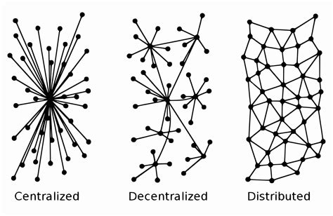
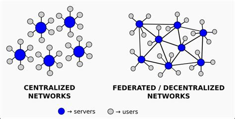
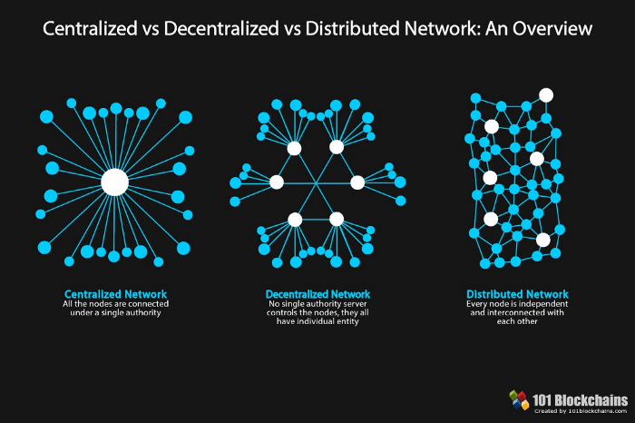

+++
title = 'What Is a Distributed Social Network Anyway?'
date = 2024-12-19T18:32:54-05:00
draft = false
tags = ["federation","social", "iamyourfather"]
+++

# What is a Distributed Social Network Anyway?

Ah, the digital age - where our lives are increasingly woven into the fabric of the internet. But let's talk about a revolution, a shift away from the corporate giants that have, for too long, held our data, privacy, and freedoms hostage. I'm a Linux enthusiast, a FOSS advocate, and a firm believer in privacy and freedom. So, let's journey through the landscape of distributed social networks, where I'm reminiscent of the old identi.ca days, and where your digital life doesn't have to be just another commodity.

## The World of Centralization

When we think of social media, most of us picture behemoths like Twitter (now X) and the ever-present eye of Meta's platforms like Facebook. These are **centralized networks**, where all your data, every tweet or post, streams through servers owned and operated by one company. 

**Advantages** of this model include:

- **Uniformity**: One app, one set of rules, one user experience. 
- **Centralized Control**: Quick response to security issues, content moderation, and platform updates.
- **Scalability**: Easier to manage and expand, given it's all under one roof.

But oh, the **disadvantages**:

- **Censorship**: One entity deciding what's seen or not seen, often swayed by political or commercial interests.
- **Privacy Invasion**: Your data is their goldmine, used for ads or sold to third parties.
- **Dependence**: Your digital life hangs by the thread of a company's financial health or strategic pivot.
- **Ads Galore**: These platforms are often ad-heavy, cluttering your feed and skewing your experience.

Imagine if one day, the corporation decides your data isn't worth keeping, and poof - your digital memories vanish. That's the reality of centralization.

## The Rise of Distributed Networks

Now, let's shift gears to the **decentralized or federated networks**, where the control is distributed among many rather than the few. Here's where we find platforms like Mastodon, Bluesky, and Diaspora, each echoing the ethos of freedom, privacy, and user control:

- **Mastodon** is like a constellation of servers where each "instance" can set its own rules, fostering unique communities. Think of it as choosing your favorite Linux distro - you get to decide where your data lives.
  
- **Bluesky** was born from Twitter's dream of decentralization but still walks the line between central and distributed. It's working on the AT Protocol, aiming for a future where you can take your social graph wherever you go. 

- **Diaspora** evokes a sense of nostalgia for me, reminiscent of identi.ca's community-driven spirit. With 'pods', it lets you be in charge of your data, much like running your own Linux server.

### The Pros of Going Distributed:

- **Censorship Resistance**: There's no single point of failure or control for censoring content.
- **Empowerment**: You can run your own server, controlling your digital footprint.
- **Privacy**: Your data isn't centralized, reducing the risk of mass surveillance or data breaches.
- **Community Governance**: Each server can reflect the values of its users, much like open-source projects.
- **Innovation**: With open-source at its core, these networks encourage developer creativity and community contributions.

### But There Are Cons Too:

- **Technical Know-How**: Running your own node isn't for the faint-hearted; it requires some Linux-like tech savvy.
- **Fragmentation**: Finding friends across different servers can be challenging, akin to navigating different Linux forums.
- **Adoption**: These networks don't yet boast the user base of their centralized counterparts, which can feel lonely if you're the only one from your real-world circle.
- **Quality of Service**: Varies depending on who's running the server, much like the diverse performance of Linux distributions.

## The Magic of Interoperability

Imagine a world where your social connections aren't bound to one platform. That's the promise of **interoperability**. Here's how it plays out:

- **Standards**: Each network uses protocols like ActivityPub (Mastodon), AT Protocol (Bluesky), or the Diaspora Protocol. These are the digital handshakes allowing servers to talk to each other. Importantly, due to the nature of these protocols, nodes from different networks can communicate as long as they are compatible or use the same protocol. This means that, in the future, we could see a much broader capability for these types of networks, effectively breaking down the siloed approach we're all too familiar with.

- **Pros**: 
  - **Freedom of Movement**: Switch servers or platforms without losing your friends or posts.
  - **Wider Network**: More potential connections, enhancing the social experience.
  - **Innovation**: Developers can build on these open standards, much like contributing to an open-source project.

- **Cons**: 
  - **Complexity**: Making all these different systems communicate can be like debugging a Linux kernel.
  - **Potential for Abuse**: Open systems can be exploited if not well-secured.
  - **Performance**: Communication across servers can sometimes be slower than within a centralized system.

**Open APIs** are crucial here, acting as gateways for third-party developers to add features or even integrate with other services, promoting a richer, more open ecosystem.

## Why Should I Want to Use a Distributed Network?

The allure of distributed networks goes beyond mere tech jargon; it touches on fundamental values like privacy, autonomy, and community:

- **Privacy and Data Control**: In distributed networks, you have control over your data. No more worrying about how your information is used or sold. Your data stays with you or on servers you trust, not in the hands of a corporation.

- **Resilience Against Censorship**: With no central authority to control content, you're less likely to encounter censorship or arbitrary content removal. This fosters a freer expression of ideas and a more diverse conversation.

- **Community and Personalization**: You can choose or even create environments that reflect your values or interests. This isn't just about where you post; it's about the kind of community you want to be part of.

- **Innovation and Openness**: The open-source nature of many distributed networks means they're constantly evolving through community input. You can participate in the development, not just consume the service.

- **Security**: By spreading data across multiple servers, the risk of a single point of failure or attack is significantly reduced. This can lead to more secure communication and storage of your data.

- **Future-proofing**: As we've seen with platforms like identi.ca, centralized networks can disappear or change dramatically. Distributed networks offer a more sustainable approach where your digital life isn't tied to one company's fate.

- **Interoperability**: The potential for networks to talk to each other means your social graph isn't locked into one platform. This can lead to a more interconnected and less isolated digital experience.

If you value your privacy, want to reduce your digital footprint, or simply seek a platform where you're not just a number but part of a community, distributed networks offer a compelling alternative to the status quo.

## A Deeper Dive into Mastodon

Mastodon has always felt like coming home for me, resonating with the FOSS philosophy:

- **Privacy**: No ads, no data mining. Your privacy is the norm, not the exception.
- **User Control**: You pick your server, your community, your rules - much like choosing your Linux environment.
- **Decentralized Moderation**: Each instance has its own ethos, allowing for diversity in community management.
- **Open Source**: The code is transparent, encouraging community involvement and enhancement.

**How to Join the Mastodon Community**:

1. **Choose Your Instance**: Look for one that matches your interests or values. Sites like [joinmastodon.org](https://joinmastodon.org/) can help.
2. **Sign Up**: It's straightforward; just like setting up a new Linux user account.
3. **Engage**: Follow, post, and interact within and beyond your instance, embracing the federated nature of the network.

Mastodon is really my social network of choice these days.

## Bluesky: A Sky Full of Possibilities

Bluesky began with a vision to decentralize social media, spearheaded by none other than Twitter's co-founder Jack Dorsey. Here's the scoop:

- **AT Protocol**: This is the heart of Bluesky's decentralization efforts, aiming for:
  - **Portability**: Move your data and identity across platforms.
  - **Modularity**: Choose your feed algorithm, like picking your favorite Linux desktop environment.
  - **Security**: Focus on privacy with features like potential end-to-end encryption for DMs.

- **Current Reality**: Bluesky's journey to true decentralization is ongoing. As of now, it operates more like a centralized network, with full interoperability with other platforms still in the blueprint stage.

- **Features**: 
  - **Custom Feeds**: Tailor your timeline to your taste.
  - **Community Moderation**: Users can influence what content they see through tools like Ozone.
  - **Identity**: Use your own domain as your handle, enhancing personal control over your online identity.

Check out [Bluesky's official site](https://blueskyweb.org/) for the latest on their journey.

## Diaspora: The Nostalgic Return to Community

Diaspora feels like a throwback to a time when social networks were about connecting people, not just data:

- **Pods**: These are your personal servers or communities, where privacy and control are paramount.
- **User-Centric**: You decide where your data lives, much like running your own Linux server.
- **Federation**: While part of a larger network, each pod maintains its individuality, like different Linux distributions.

**Why Diaspora Captures My Heart**:

- It embodies the ethos of privacy and control that's core to the FOSS movement.
- It's a testament to what social networking can be when it's not about profit but about people.

Explore more at [Diaspora's official site](https://diasporafoundation.org/).

## Wrapping It Up: Why This Matters

In a world where our digital lives are increasingly controlled by corporate entities with their own agendas, distributed networks offer a beacon of hope. They're not just platforms; they're movements towards reclaiming our digital rights, privacy, and freedom. They embody the spirit of Linux and FOSS, where users aren't just consumers but participants, creators, and stewards of their digital spaces.

If you're like me, yearning for a return to a more open, user-controlled internet, these platforms are your allies. Mastodon, with its vibrant communities; Bluesky, with its promise of a decentralized future; and Diaspora, with its nostalgic nod to simpler times - each offers a way out of the corporate social media maze.

So, I urge you to explore these alternatives:

- Dive into the Mastodon universe at [joinmastodon.org](https://joinmastodon.org/).
- Keep an eye on Bluesky's developments at [blueskyweb.org](https://blueskyweb.org/).
- Rediscover community with Diaspora at [diasporafoundation.org](https://diasporafoundation.org/).

Maybe you'll find that the grass is indeed greener on this side of the digital fence, where your data isn't the product, where privacy isn't a luxury, and where community isn't just a marketing term. Here's to hoping more of us will choose freedom over convenience, community over corporation, and in doing so, reshape the very fabric of our online interactions. 

### Sources and Further Reading

For those keen on exploring the broader landscape of decentralized networks and the philosophy behind them, here are some resources to enlighten your journey:

- **[Join Mastodon](https://joinmastodon.org/)** - An entry point to explore and join the Mastodon network, reflecting the user-controlled ethos discussed here.
  
- **[Bluesky Web](https://blueskyweb.org/)** - Stay updated on Bluesky's efforts to innovate social media with a focus on user control over data.

- **[Diaspora Foundation](https://diasporafoundation.org/)** - Learn more about Diaspora, a platform that echoes the community spirit of early social networks.

Additional readings that delve into the concepts of decentralization and user empowerment:

- **[Re-Imagining Decentralized and Distributed](https://www.windley.com/archives/2015/01/re-imagining_decentralized_and_distributed.shtml)** by Phil Windley - Offers insights into decentralization beyond social media, highlighting the broader implications for digital autonomy.

- **[Comunicación Libre y Descentralizada](https://metal-libre.org/2014/03/comunicacion-libre-y-descentralizada.html)** - An article emphasizing free and decentralized communication, aligning with the privacy and freedom themes of this post.

- **[Personal Channels](https://www.windley.com/archives/2012/06/personal_channels.shtml)** by Phil Windley - Discusses how individuals can manage their own data streams, which is at the heart of what distributed networks aim to achieve.

- **[Decentralized Networks as a Tool for Fighting Disinformation and Censorship](https://link.springer.com)** - Provides an academic perspective on how decentralized networks can address digital challenges.

- **[Cointelegraph on Decentralized Social Networks](https://cointelegraph.com)** - Discusses the evolving landscape of decentralized social media and its implications.

- **[List of Social Networking Services - Wikipedia](https://en.m.wikipedia.org)** - A comprehensive list for understanding the variety of social platforms, including decentralized ones.

- **[Distributed Social Networking Protocol - Wikipedia](https://en.wikipedia.org)** - Details on DSNP, shedding light on the technical aspects of decentralization.

- **[Freedom on the Net by Freedom House](https://freedomhouse.org)** - An annual report on internet freedom, relevant to discussions on privacy and censorship in social media.

These sources provide a wealth of knowledge for anyone looking to understand or contribute to the evolution of a more open, connected, and user-empowered internet. If you're passionate about reclaiming control over your digital life, these readings are a great start to your journey towards digital freedom.

## Note on AI help

I used [xAI's Grok](https://grok.x.com) to help construct this post and put all of the information together. You can find the prompts/content/conversation [here](https://x.com/i/grok/share/mVDCdqWfDzwtZ59F5t1vJ3FTQ).
